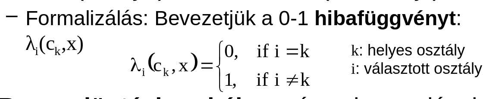
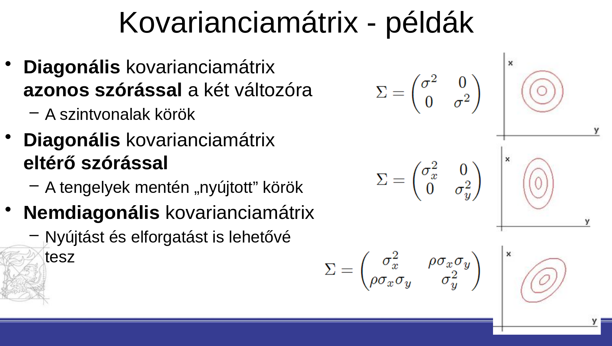

# 3. tétel

## A Bayes döntési szabály, diszkriminánsfüggvények és döntési felületek

Minimalizálandó a téves osztályozások száma hosszú távon (accuracy)

Bayes döntési szabály: téves besorolások aránya akkor lesz minimális, ha minden x input vektorhoz azt a c(i) osztályt választjuk, amelyre P(c(i)|x) maximális.

- Minden c(i) osztályhoz készítünk egy g(i)(x) diszkrimináns függvényt
- Adott x tesztpéldát abba az osztályba rakjuk, amelyre g(i)(x) maximális
- Diszkrimináns függvény: g(i)(x) = P(c(i) | X), ez a garantált optimális
  - gyakorlatban ezzel ekvivalens formákat is használhatunk: pl. g(i)(x) = ln(p(x|c(i))\*P(c(i)))
- Véges tanulóhalmaz alapján a P... minnél pontosabb becslése

- Diszkriminánsfüggvények és döntési szabályok indirekt módon döntési felületeket határoznak meg
  - döntési felületek az osztályok közti határok
  - ott helyezkedik el, ahol két osztály diszkrimináns függvénye megegyezik, g(i)(x) = g(j)(x)

## Bayes-döntés diszkrét és folytonos jellemzők mellett (leszámlálás), Gauss-eloszlások néhány speciális esetében a döntési felület alakja

- Diszkrét valószínűségi eloszlás egyszerű, leszámlálással
  - Kevés lehetséges értékre, sok tanítópéldára működik
  - Sok érték / kevés példa -> pontatlan becslések
- Folytonos valószínűségi eloszlás esetén, valamilyen folytonos görbével leírható
  - Leggyakrabban normális / Gausz eloszlás

Kovariancia mátrixok:

Ha két osztályunk van, eloszlásuk normális, döntési szabályhoz keressük a maximális P(ci|x) = p(x|ci)\*P(ci)/p(x)

- p(x) konstans, ez nem befolyásolja a maximalizálást
- más, monoton transzformáció sem, pl. logaritmikus

## A statisztikai alakfelismerési módszer hibalehetőségei (Bayes hiba, modellezési hiba, paraméterbecslési hiba), a hibák kezelése

- Bayes hiba: jellemzők alapján az osztályok nem szétválaszthatóak
  - csökkentése: jobban leíró jellemzők bevezetése, használata
- Modellezési hiba: ha a választott eloszlás nem illeszkedik az adatok eloszlására
  - gyakorlatban ez mindig jelen lesz, valamilyen eloszlást kell választanunk, és az soha nem fog tökéletesen illeszkedni
  - a lényeg, hogy olyan eloszlást válasszunk ami minnél közelebbi
- Paraméterbecslési hiba: modell paramétereit tanítópéldák alapján valamilyen tanulóalgoritmussal fogjuk becsülni
  - csökkenthető tanítópéldák számának növelésével
  - és a tanulóalgoritmus pontosságának javításával

## A Naiv Bayes osztályozó (motiváció, megoldás, előnyök és hátrányok)

- Motiváció: sok változós (magas dimenziószámú) eloszlás paramétereinek becslése matematikailag nehéz, sok adatot igényel. A naív Bayes ezt próbálja leegyszerűsíteni.
- A modell feltételezi, hogy a jellemzők függetlenek egymástól. Emiatt d darabb (d = változó számok) 1 változós eloszlás függvényeket becsülünk, és azok szorzata adja meg a végső valószínűséget

- Egyszerű, emiatt könnyű implementálni, hatékonyan kezeli a ritka adatokat, képes diszkrét és folytonos jellemzőket egyszerre kezelni
- Hátránya, hogy hamis feltevéssel működik, a gyakorlatban a változók egymástól függenek.

- Ettől függetlenül jól működik.
